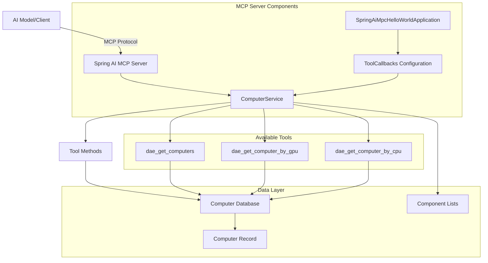

# Spring AI MCP Hello World

A demonstration project showcasing the integration of Spring AI with the Model Context Protocol (MCP) to create a computer inventory management system. This project implements an MCP server that provides AI models with tools to query and manage a database of gaming computers.

## Overview

This application creates an MCP server that exposes computer inventory data to AI models through standardized tools. The server generates a collection of 30 gaming computers with randomized specifications and provides tools for querying this data by CPU, GPU, or retrieving all computers.

## Features

- **MCP Server Implementation**: Built using Spring AI's MCP server starter
- **Tool-based AI Integration**: Exposes three main tools for AI interaction:
  - `dae_get_computers`: Retrieve all computers in the database
  - `dae_get_computer_by_gpu`: Find computers by GPU specification
  - `dae_get_computer_by_cpu`: Find computers by CPU specification
- **Random Data Generation**: Creates 30 gaming computers with randomized components
- **Structured Data Model**: Uses Java records for clean data representation

## Architecture Flow



## Project Structure

```
src/
├── main/
│   ├── java/com/daebecodin/springaimpchelloworld/
│   │   ├── SpringAiMpcHelloWorldApplication.java  # Main application class
│   │   ├── ComputerService.java                   # Service with MCP tools
│   │   └── Computer.java                          # Data model record
│   └── resources/
│       ├── application.properties                 # Configuration
│       └── logback-spring.xml                     # Logging configuration
└── test/
    └── java/                                      # Test classes
```

## Technology Stack

- **Java 24**: Latest Java version with modern language features
- **Spring Boot 3.5.3**: Application framework
- **Spring AI 1.0.0**: AI integration framework
- **MCP (Model Context Protocol)**: Standardized AI-application communication
- **Gradle**: Build automation tool

## Prerequisites

- Java 24 or higher
- Gradle (or use included Gradle wrapper)

## Setup and Installation

1. **Clone the repository**:
   ```bash
   git clone <repository-url>
   cd spring-ai-mpc-hello-world
   ```

2. **Build the project**:
   ```bash
   ./gradlew build
   ```

3. **Run the application**:
   ```bash
   ./gradlew bootRun
   ```

## Configuration

The application is configured as a non-web Spring Boot application that runs as an MCP server:

- **Server Name**: `daebecodin-pc-list`
- **Version**: `0.0.1`
- **Transport**: STDIO (Standard Input/Output)
- **Logging**: Disabled for console to prevent MCP protocol interference

## Computer Specifications

The application generates computers with the following component options:

**Motherboards**:
- ASUS ROG Strix B550-F Gaming
- MSI MAG X570 TOMAHAWK
- Gigabyte Aorus B450 Elite

**CPUs**:
- AMD Ryzen 5 5600X
- AMD Ryzen 7 5800X
- Intel Core i7-12700K

**GPUs**:
- NVIDIA RTX 3080
- NVIDIA RTX 3070 Ti
- AMD Radeon RX 6800 XT

**RAM**:
- 16GB DDR4-3200
- 32GB DDR4-3600
- 16GB DDR4-4000

**Coolers**:
- Corsair iCUE H100i RGB
- Noctua NH-D15
- be quiet! Dark Rock Pro 4

**Cases**:
- NZXT H510
- Fractal Design Meshify C
- Phanteks Eclipse P400A

## MCP Tools

### `dae_get_computers`
Returns all computers in the database.

**Parameters**: None
**Returns**: List of all Computer objects

### `dae_get_computer_by_gpu`
Finds computers with a specific GPU.

**Parameters**: 
- `gpu` (String): GPU model to search for

**Returns**: List containing the first matching Computer object

### `dae_get_computer_by_cpu`
Finds computers with a specific CPU.

**Parameters**: 
- `cpu` (String): CPU model to search for

**Returns**: List containing the first matching Computer object

## Usage with AI Models

This MCP server can be integrated with AI models that support the Model Context Protocol. The AI model can call the exposed tools to:

1. Browse the complete computer inventory
2. Find computers with specific GPU requirements
3. Find computers with specific CPU requirements
4. Get detailed specifications for decision making

## Development

### Running Tests
```bash
./gradlew test
```

### Building Distribution
```bash
./gradlew build
```

## Contributing

1. Fork the repository
2. Create a feature branch
3. Make your changes
4. Add tests if applicable
5. Submit a pull request

## License

This project is a demonstration/educational example. Please refer to the license file for specific terms.

## Troubleshooting

### Common Issues

1. **MCP Protocol Issues**: Ensure console logging is disabled as it interferes with the STDIO transport
2. **Java Version**: Make sure you're using Java 24 or compatible version
3. **Build Issues**: Try cleaning the build with `./gradlew clean build`

### Debugging

To enable debugging, uncomment the logging configuration in `application.properties` and modify the logback configuration to redirect logs to stderr.

## Future Enhancements

- Add more computer management tools (add, update, delete)
- Implement persistent storage
- Add computer availability and pricing information
- Extend search capabilities with multiple criteria
- Add computer comparison tools
